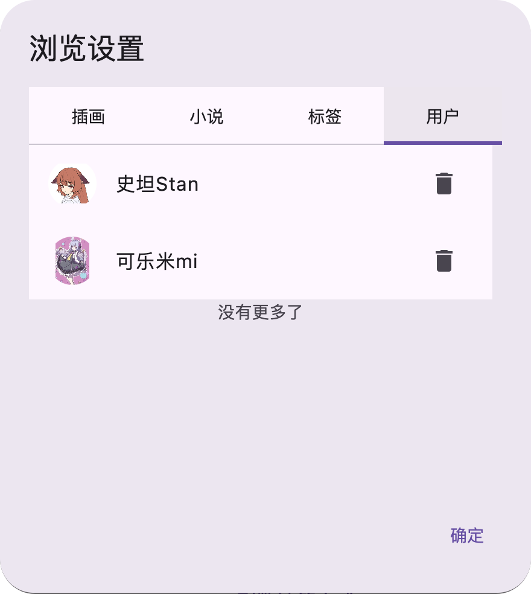

# ブラックリストシステム

:::warning
**PMF v1.8.3 以上のバージョンにのみ適用されます。**
:::

### 概要

PMF ソフトウェアは、不要なコンテンツをブロックするのに役立つ強力なコンテンツ フィルタリング システムを提供します。主に **タグフィルタリング** と **ユーザーフィルタリング** という 2 つのフィルタリング方法が含まれています。

* **タグフィルタリング:** イラストや小説の検索ページ専用で、特定のタグを含む作品を自動的に非表示にしたりフィルタリングしたりします。
* **ユーザーフィルタリング:** 指定したユーザーが公開しているすべてのイラストと小説をブロックし、あなたの視野に表示されないようにします。

---

### フィルタリング方法

不要なコンテンツをブラックリストに追加するには、次の 2 つの簡単な方法があります。

#### 2.1 ユーザーをフィルタリング

特定のユーザーからのすべての作品をブロックすることに決めた場合、そのユーザー情報を表示するページ（例：イラスト詳細ページ、小説詳細ページ、またはユーザープロフィールページ）で、以下の名前のボタンまたはリンクを見つけてクリックできます。

> **このユーザーをブロックリストに追加する**

クリック後、このユーザーをブラックリストに追加するかどうかを確認するよう求められます。

#### 2.2 タグをフィルタリング

特定のタグをブロックする場合は、次のページのいずれかで行うことができます：イラスト詳細ページ、小説詳細ページ、またはタグ検索結果ページ。

作品の **TAG エントリ**（つまりタグ自体）を操作する必要があります。

* **デスクトップ:** マウスを使ってタグを**右クリック**します。
* **モバイル:** タグを**長押し**します。

上記の操作を実行すると、**ブロック確認ダイアログ**が画面に表示され、タグをフィルタリスト に追加するかどうかを確認できます。

### フィルタリングの影響

ブラックリストフィルタリングを設定した後、PMF ソフトウェアを使用してコンテンツを閲覧すると、次の変更が発生します。

#### 3.1 ユーザーをフィルタリングした後の影響

ユーザーをブラックリストに追加すると、そのユーザーの **プロフィールページ**（つまり個人的なホームページ）をクリックして入ろうとすると、ソフトウェアはそのページをロードすることを**拒否**し、このユーザーの情報や作品リストを閲覧することができません。

#### 3.2 タグをフィルタリングした後の影響

特定のタグをフィルタリングすると、これらのタグは以下に表示されなくなります。

* **人気タグリスト**内。
* 検索ボックスに入力して**検索**する場合、検索内容に**ブロック済みタグが含まれている**場合、ソフトウェアはこの検索の実行を**拒否**します。

:::tip なぜこれを行うのですか？

これはサーバーリソースとアクセスセキュリティのためです。

ユーザーが大量のブロック済みコンテンツを含むページを自由に閲覧することを許可すると（例えば、ブロック済みタグを含む大規模な検索結果ページ）、必然的に PMF ソフトウェアがサーバーに大量のフィルタリングとリクエストを送信することになります。

このような短時間での大量のリクエストは、pixiv の公式サーバーのリスク制御メカニズムをトリガーする可能性があり、その結果、アクセスが制限される可能性があります。

したがって、大量のリクエストを引き起こす可能性があるこれらのページをブロックすることは保護措置です。
:::

### ブロック解除方法

以前に追加したブラックリストルールを削除し、ブロック済みコンテンツを再度表示させたい場合は、次の手順で管理できます。

1.  **PMF ソフトウェアの設定ページを開く**
2.  **「閲覧設定」**という名前のタブに入る
3.  閲覧設定で、**「ブラックリスト管理」**ダイアログ（またはボタン）を見つけてクリックして開く
4.  ポップアップ表示された管理ダイアログで、設定されているブラックリストルールが **タグ ブラックリスト** と **ユーザー ブラックリスト** の 2 つの主要カテゴリに明確に分割されているのが見えます。
5.  **管理と削除:** 対応するカテゴリリストで、ブロック解除したいタグまたはユーザー名を見つけて、**削除**操作を実行します。ルールが削除されると、対応するコンテンツが閲覧結果に再度表示されます。

