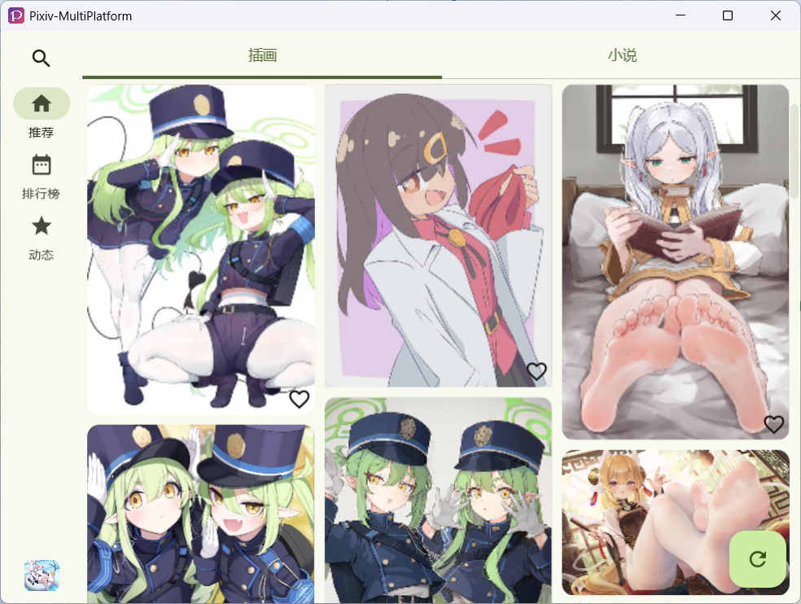
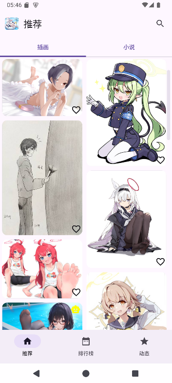
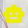
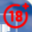
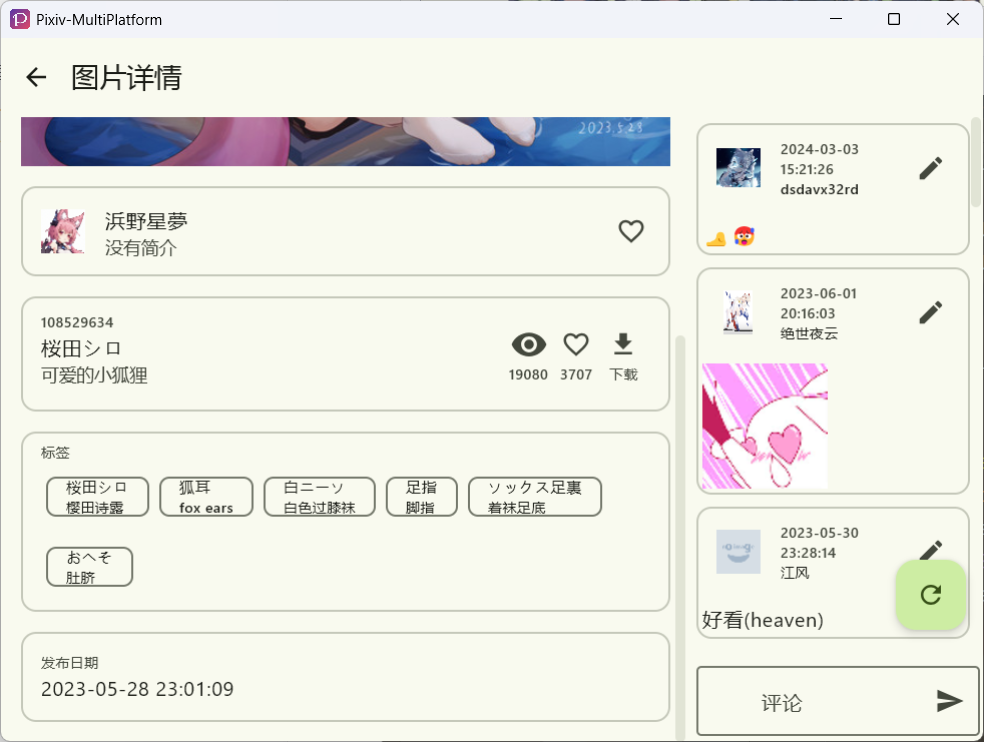
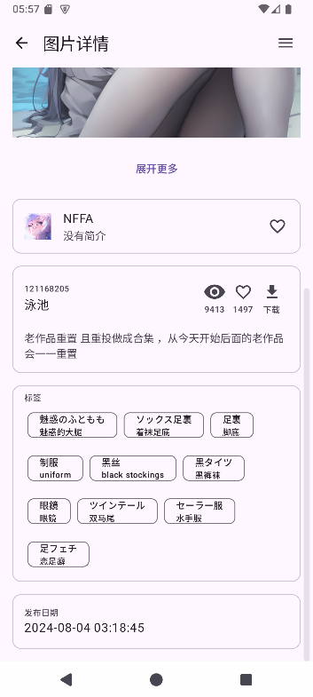

# イラスト

## 1. ブラウジング

イラストブラウジングページはこのようになります：

| PC                                                           | スマートフォン                                                        |
| ------------------------------------------------------------ | ------------------------------------------------------------ |
|  |  |

- ハート型をクリックするとブックマークでき、もう一度クリックするとキャンセルできます
  
  > ハートアイコンを長押しすると TAG でブックマークでき、ブックマークのカテゴリを設定できます

- デスクトップでは、`R` キーを押すか、右下の上ボタンをクリックして上部に戻ります。もう一度 `R` を押すと更新されます。
  
  モバイルでは、トップボタンをクリックして上部に戻り、下方にスワイプして更新してください。

- PC ショートカットについては、[ショートカット](docs/main/keyword.md) を参照してください

- 画像をクリックしてイラストプレビューページに移動します。ナビゲーションバーをクリックして異なるモジュールに移動できます。

> ### 特別なイラストマーカー
> 
> イラストプレビュー中に、右上に表示されるマーカーに気づくかもしれません。
> 
> 以下は、これらのマーカーの機能です。
> 
> :::tip
> 
> これらのアイコンで表されるイラストは、設定でフィルタリングできます
> :::
> 
> | アイコン                                                                       | 簡単な紹介 | 機能                     |
> | ------------------------------------------------------------------------ | ---- | ---------------------- |
> |  | AI生成 | この画像が AI を通じて生成されたことを示します。 |
> |  | R18  | この画像が成人向けコンテンツを含むことを示します |
> |  | R18G | この画像が奇抜な要素やほとんどのユーザーに適さない他の要素を含むことを示します |
> 
> :::danger
> 
> R-18G アイコンが表示されると、R18 アイコンも表示されます。
> 
> :::

## 2. イラスト詳細ページ

イラスト詳細ページはこのようになります：

| PC                                                                       | スマートフォン                                                                    |
| ------------------------------------------------------------------------ | ------------------------------------------------------------------------ |
|  |  |

### イラスト画像

著者がアップロードした様々なイラストを表示します。 3 つ以上を超えるイラストは折りたたまれます。

### 著者タグ

著者のユーザー名と自己紹介を表示します。 著者のアバターをクリックして、著者のホームページに移動できます。

右のハートをクリックして著者をフォローします。長押しすると静かにフォローします。

### タイトルと説明

pid、タイトル、および説明が含まれます。

その中で: pid とタイトルはクリックコピーでき、説明は長押ししてコピーできます。

右の 3 つのアイコンは、ブラウジング、ブックマーク、ダウンロード用です。

その中で：ブックマークのクリックと長押しの効果はブラウジングページでの操作と同じです。

ダウンロードをクリックするとイラストをダウンロードできます。

### コメントセクション

:::note

モバイルのコメントセクションは横引き出しに折りたたまれており、**画面の右側から左側に スワイプ**して正しくポップアップする必要があります。

:::

:::danger

**重要な変更通知**: v1.8.0 以降、モバイルイラスト詳細ページのスワイプジェスチャが前/次の画像を切り替えるように変更されました。

スワイプしてコメントセクションを開く機能を復元するには、次の設定パスを構成してください:
**イラスト設定** → **イラスト詳細ページスワイプアクション** → **コメント展開を選択**

:::

1. 入力ボックスにテキストを入力して送信するとコメントできます。
2. 返信モードで左上の矢印をクリックして返信モードを終了します。

## 3. イラストプレビュー設定

### アスペクト比でフィルタリング

この機能により、コンピューターまたは携帯電話の壁紙のイラストを簡単にフィルタリングできます：

- **フィルタリングなし**: すべてのイラストをアスペクト比の制限なしで表示
- **幅 > 高さ**: ランドスケープ/ワイドイラストをフィルタリング (コンピューター壁紙に適しています)
- **高さ > 幅**: ポートレート/トールイラストをフィルタリング (携帯電話の壁紙に適しています)

### デフォルトですべてのギャラリー画像を表示

有効にした場合、この設定により 3 つ以上のギャラリー画像の自動折りたたみが防止されます。 ギャラリーのすべての画像はデフォルトで展開表示され、より良いブラウジング体験が提供されます。

### オリジナル画像を表示

有効にした場合、詳細ページはデフォルトで元の解像度の画像をロードします。

:::warning

**帯域幅警告**: この機能を有効にすると、オリジナル画像はプレビュー画像よりもはるかに大きいため、かなりの帯域幅が使用されます。 安定したインターネット接続と十分な帯域幅がある場合にのみ有効にしてください。

:::