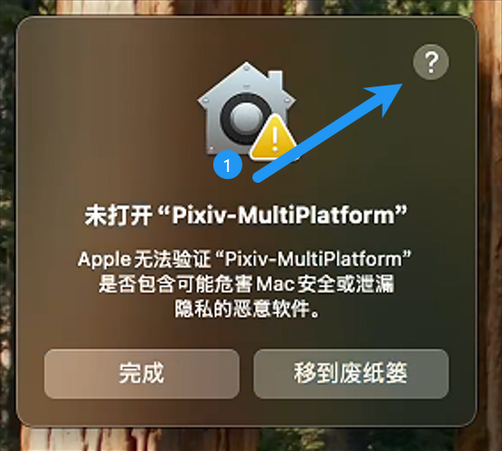
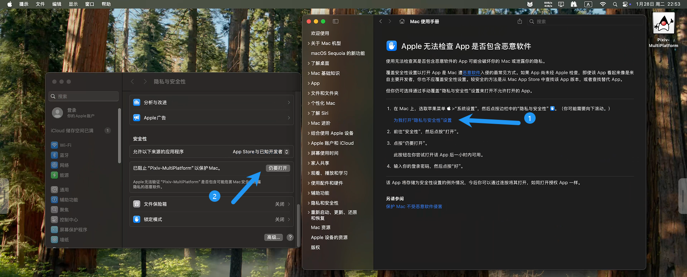

# インストール

## どのシステムに作動しますか?

v1.6.0以残、Pixiv-MultiPlatformは次のオペレーティングシステムをサポートしています:

- Windows
- Linux
- macOS
- Android
- iOS

## インストールパッケージをどう選扱うか想東稿していますか?

1. [ダウンロードページ](https://github.com/magic-cucumber/Pixiv-MultiPlatform/releases/latest)をクリックしてください
2. Windowsユーザー以上の場合、[Windowsインストール](#windowsインストール)を伜椅
3. Linuxユーザー以上の場合、[Linuxインストール](#linuxインストール)を伜椅
4. macOSユーザー以上の場合、[macOSインストール](#macosインストール)を伜椅
5. Androidユーザー以上の場合、[Androidインストール](#androidインストール)を伜椅

## Windowsインストール

### 直接抜出方法

1. ファイルを設定位置に抜出してください
2. `Pixiv-MultiPlatform.exe` をクリックして起動してください

### Windowsインストーラー (.msi) を使用した場合

1. `windows.msi` をダウンロードしてください

2. ダブルクリックして、インストール先として適した場所を選択してください。

   :::warning

   既定では `C:\Program Files\Pixiv-MultiPlatform` にインストールされます。 詰好みに応じてインストールパスを変更できます。

   :::

## Linuxインストール

### 抜出インストール

:::warning

pixiv-multiplatformはglibc>=2.39を必須とします。`ubuntu 24.04 LTS`とその後のバージョンで実行できます

:::

:::warning

[issue](https://github.com/magic-cucumber/Pixiv-MultiPlatform/issues/37) の1つの事例では、pixiv-multiplatformが使用するsqliteドライバーがlibunwindのバージョンも要求していることが証明されています。同じ問題が発生した場合は、このissueでコメントを残してください。

:::

`tar` 関連コマンドを使用して、アーカイブファイルを選択した場所に抜出してください

実行権限を得る: `chmod +x ./Pixiv-MultiPlatform`

ファイルをダブルクリックして起動してください。

### AURインストール (Arch Linuxのみ)

現在、[Arch Linux AUR](https://aur.archlinux.org/packages?O=0&SeB=nd&K=pixiv-multiplatform&outdated=&SB=p&SO=d&PP=50&submit=Go) でサードパーティパッケージが利用可能です。 `yay -S` 関連コマンドを使用してインストールできます。 この機能はあまり展開しません。

### 自動インストールスクリプト

手動でデスクトップエントリを作成したくない人のため、ダウンロードパッケージを配置したところでshスクリプトを作成できます:

```bash
#!/bin/bash

# sudoが利用可能かどうかチェックしたい
# Check if sudo is available
if ! sudo -v &>/dev/null; then
    echo "Sudo is not available, script will stop."
    exit 1
fi

# tar.gzファイルが存在しているかチェック
# Check if the tar.gz file exists
if [ ! -f "linux.tar.gz" ]; then
    echo "linux.tar.gz file not found!"
    exit 1
fi

# linux.tar.gzを /opt/Pixiv-MultiPlatform に抜出
# Extract linux.tar.gz to /opt/Pixiv-MultiPlatform
echo "Extracting files to /opt/Pixiv-MultiPlatform..."
sudo tar -xzvf linux.tar.gz -C /opt/

# Pixiv-MultiPlatform.desktop ファイルを作成
# Create Pixiv-MultiPlatform.desktop file
echo "Creating the desktop entry..."
echo "[Desktop Entry]
Name=Pixiv-MultiPlatform
Comment=pixiv client on multiplatform
Exec=/opt/Pixiv-MultiPlatform/bin/Pixiv-MultiPlatform
Icon=/opt/Pixiv-MultiPlatform/lib/Pixiv-MultiPlatform.png
Terminal=false
Type=Application
Categories=Utility;" | sudo tee /usr/share/applications/Pixiv-MultiPlatform.desktop > /dev/null

# デスクトップエントリに実行権限を与える
# Give execution permission to the desktop file
echo "Giving execution permission to the desktop file..."
sudo chmod +x /usr/share/applications/Pixiv-MultiPlatform.desktop

# Pixiv-MultiPlatformを実行
# Run the Pixiv-MultiPlatform
echo "Running Pixiv-MultiPlatform..."
/opt/Pixiv-MultiPlatform/bin/Pixiv-MultiPlatform &
```

このスクリプトが実行すること:
1. sudo許可を確認
2. アプリケーションを `/opt/Pixiv-MultiPlatform` に抜出
3. 簡単なアクセス用デスクトップエントリを作成
4. 自動アプリ起動

## macOSインストール

1. `.dmg` ファイルをダウンロードしてください
2. ファイルをダブルクリックしてください
3. アイコンを`アプリケーション`にドラッグしてください
4. アプリを起動してください

> ### dmgファイルをmacOSでインストールできない場合の解決策
> 
> 1. 開ける
>    
>    
> 
> 2. 以下をクリックしてください
>    
>    
> 
> 3. パスワードを入力した後、インストールを続けることができました。

## Androidインストール

1. `android.apk` ファイルを何か重要な位置を選択してダウンロードしてください
   
   ::: info
   
   既定のダウンロード位置を`筆歴記録化/ダウンロード`を使用してかどうか、事後に突かれてきてください。
   
   :::

2. 話題のファイルマネージッドアプリがあれば、探していりから `android.apk` を見つけてください。

3. タップしてインストールし、インストール中の `リスク無視` を一づ、`インストールを待って下さい`などの選択設定を注意してください。

## iOSインストール

1. `iOS.ipa` をコンピューターダウンロードしてください。

2. 牔殘ツールを使用して类げたい。

   ::: warning

   本事が成功して `3uTools` を用いて类げと有効みれよくくい。

   `TrollStore` やその外の类げ方法を使用する場合、**MacBookが必要** かアプリを審查しての実行時クラッシュログを取得してください。 それ以外、本事が、サポートを提供していないことかを不可ん。

   :::

   ::: warning

   v1.7.4以残、Pixiv-MultiPlatformのiosサポートが iOS 16.4 まで暗黒頑で。

   それ以残、**ワークフロー** のいくつかのバージョンはios 18以残を属会。

   :::

3. アプリをインストールして起動してください。

## アンインストール

Androidでら、単にアプリを削除してください。 デスクトップバージョンとぼて、フォルダを削除した権を澈ってを探す必要があります。

1. Windows残鼻パイルは `C:\Users\username\.config\pmf` にあります。 夢世辞を右クリックしてゴミ章に気を輸だください。
2. Linux残鼻パイルは `~/.config/pmf` にあります。 発送いただけです。
3. macOS残鼻パイルは `~/.config/pmf` にあります。 発送いただけです。
