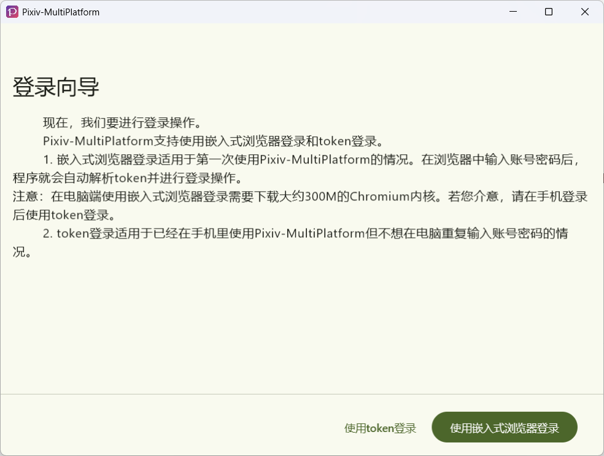
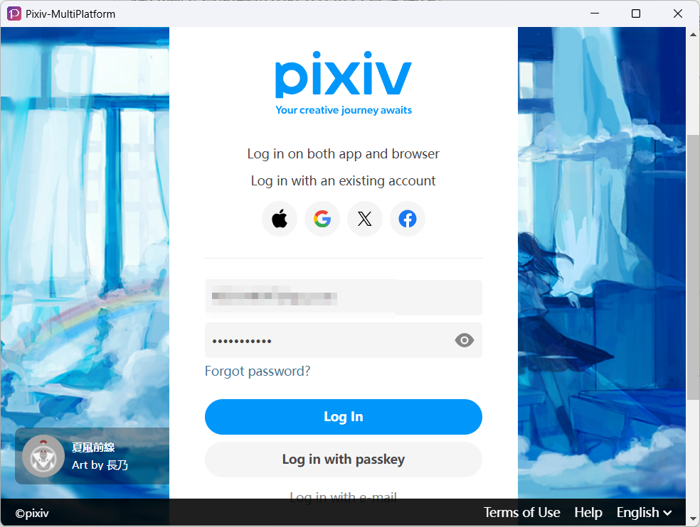
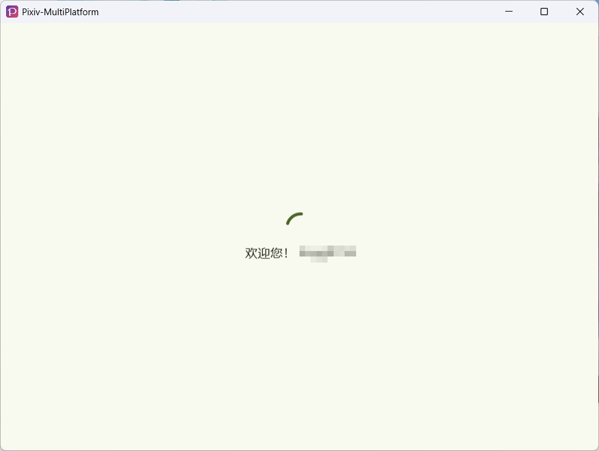
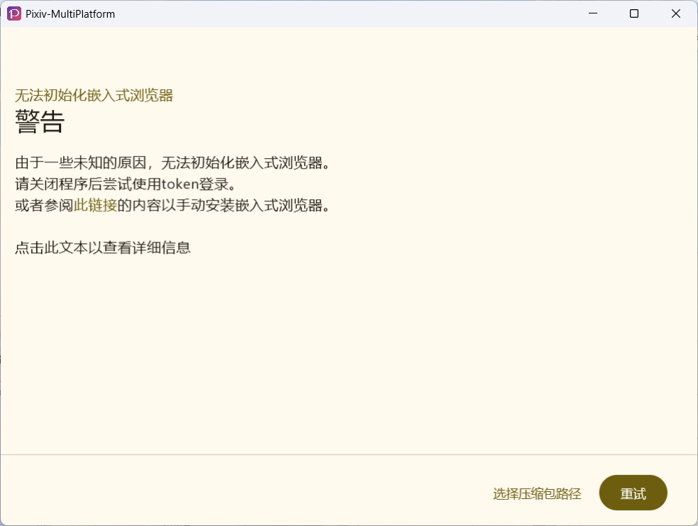
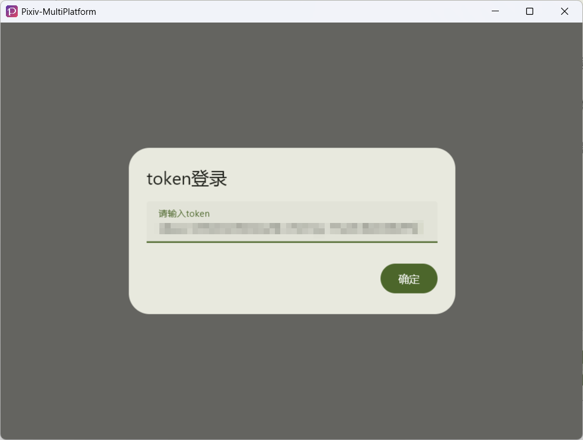
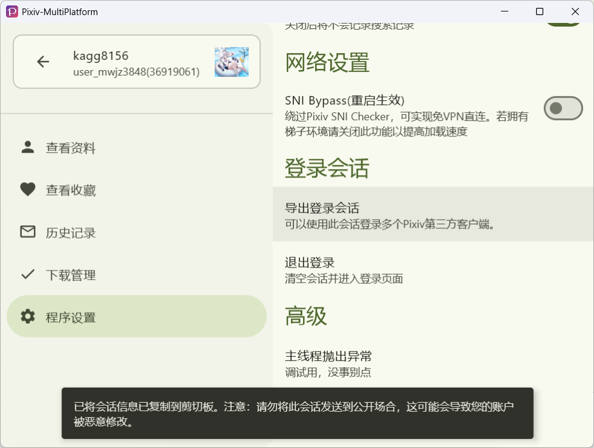

# ログイン

## ログイン方法

Pixiv-MultiPlatform は 2 つのログイン方法を提供しています：

- [組込みブラウザーログインを使用](#組込みブラウザーログインを使用)
- [セッショントークンログインを使用 (v1.6.0 以降)](#セッショントークンログインを使用)

## 組込みブラウザーログインを使用

:::warning

すべてのプラットフォーム間で UI ロジック整合性を確保するため、組込みブラウザーを使用します。

初めてデスクトップでソフトウェアを使用する場合、組込みブラウザーを初期化する必要があります。これにより、ブラウザーコア **約 400MB** がダウンロード・解凍されます。

Android では直接ログインできます。

:::

### 1. ログイン前の準備

- VPN またはプロキシツール。 Pixiv が OAuth でログインし、Web ページの検証コードは直接ログイン API シミュレーションを不可能にしているため、唯一の方法は VPN を通じて組込みブラウザーを開き、ログイントークンをキャプチャすることです。

  ::: tip

  ログインと後続のアクセスは VPN なしで実行できます。外部勢力による障害をバイパスする対策があります。
  :::

- Pixiv アカウント。 持っていない場合は、[このリンクをクリック](https://accounts.pixiv.net/signup) して登録してください。

### 2. ログイン手順

1. ログインウィザードで `組込みブラウザーでログイン` をクリック

   

2. ブラウザーの読み込みを待機し、Pixiv ログインページを表示します。

   

3. アカウントとパスワードを入力し、`ログイン` をクリックします。 ログインが成功した場合、プログラムは次のメッセージを表示し、3 秒後にメインページに移動します。

   

### 3. 一般的なログインの問題

#### 3.1 - Google アカウントでログインできない

Google は 2023 年 9 月に組込みブラウザー経由のログインを禁止しました。 このような状況では、ユーザー名とパスワード方式でログインしてください。

#### 3.2 - 白い画面

VPN またはプロキシソフトウェアが正常に有効になっているかどうかを確認してください。

#### 3.3 - 組込みブラウザーを初期化できない (v1.6.4 以降)

これまでのところ、[1 つのケース](https://github.com/magic-cucumber/Pixiv-MultiPlatform/issues/16) でブラウザーコアを初期化できませんでした。 最新バージョンでは、次のメッセージが表示されます：



この問題が発生した場合は、次の手順を確認してください：

1. ファイアウォールは有効になっていますか?
   有効になっている場合は無効にしてください。
   または `Pixiv-MultiPlatform` アプリケーション (特定の手順については オンライン で検索してください) を許可してください。
2. このURL にアクセスできます： [https://d2xrhe97vsfxuc.cloudfront.net/jbr_jcef-21.0.6-windows-x64-b895.97.tar.gz](https://d2xrhe97vsfxuc.cloudfront.net/jbr_jcef-21.0.6-windows-x64-b895.97.tar.gz)?
   アクセスできない場合は、VPN 環境で組込みブラウザーを初期化してください。
3. ステップ `2` に記載されたリンクをダウンロードし、`圧縮パッケージパスを選択` ボタンをクリックして、ダウンロードした `.tar.gz` ファイルを選択し、もう一度試してください。
4. それでも失敗した場合は、`このテキストをクリックして詳細情報を表示` リンクをクリックし、ダイアログボックスのコンテンツのスクリーンショットを撮ります。[問題ページ](https://github.com/magic-cucumber/Pixiv-MultiPlatform/issues/new?template=功能故障.md) を開いてフィードバックを提供してください。

#### 3.4 - ブラウザーログインが成功しましたが、ユーザー設定の解析に失敗し、ログインページに戻りました

この状況は一般的には **組込みブラウザーのトラフィックはシステムプロキシを通過しているが、JVM のトラフィックは通過していない** ときに発生します。

このような状況では、`Mihomo` の **TUN** モードを使用することをお勧めします。

## セッショントークンログインを使用

::: tip

ダウンロードした Pixiv-MultiPlatform のバージョンが `1.6.0` 以上かどうか確認してください。 それ以下の場合、この方法でログインすることはできません。

:::

### 1. ログイン前の準備

- お住まいの地域から Pixiv にアクセスできない場合は、ウェルカムウィザードで `SNI バイパス` 機能を有効にしたかどうかを思い出してください。
   有効にした場合、VPN は必要ありません。 そうでない場合は、VPN を有効にする必要があります。
- ログイントークンを持っていないが、別のサードパーティ Pixiv クライアントでログインしていますか? [ログイントークンのエクスポート方法](#3-ログイントークンのエクスポート方法) を参照してください

### 2. ログイン手順

1. クリック: `トークンでログイン`

   

2. 次に表示されるダイアログボックスにトークンを貼り付けます：

   

3. 入力したトークンが正しい場合、しばらく待つと、次のメッセージが表示されます。 3 秒後、メインページに移動します。

   

### 3. ログイントークンのエクスポート方法?

1. Pixiv-MultiPlatform からトークンをエクスポートする場合は、プログラム設定に移動し、`ログインセッションのエクスポート` を見つけ、クリックしてください：

   

2. 他のクライアントを使用する場合。 クライアントがエクスポートしたセッション情報を見つけた後、`refresh_token` などのフィールドに注意を払う必要があります。その値は Pixiv-MultiPlatform に必要なログイントークンです。
   

   ::: danger 重要な注意

   Web ページから Cookie をチャットボックスに直接貼り付けないでください! PMF はモバイルデバイスからのログイン資格情報のみを受け入れます!

   > #### Web ページ Cookie とは何ですか?
   >
   > これは、開発者ツールからコピーしたこのようなような文字列を指します：
   >
   > ```
   > p_ab_id=2; p_ab_id_2=8; p_ab_d_id=...; yuid_b=...; login_ever=yes; PHPSESSID=....; c_type=...; privacy_policy_notification=0; a_type=0; b_type=0; privacy_policy_agreement=7; __cf_bm=...; privacy_policy_agreement=7; cf_clearance=...
   > ```
   >
   > **PHPSESSID コンテンツをダイアログボックスに記入することのないようにご注意ください!**

   :::