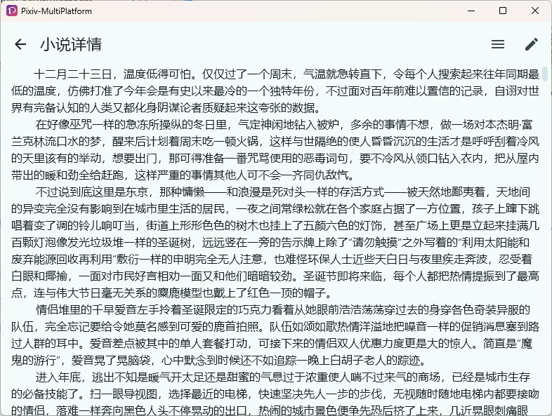
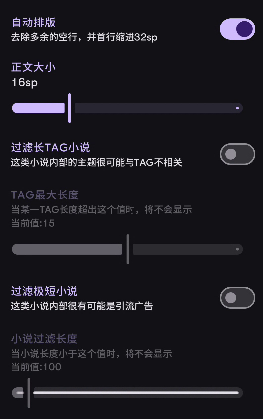
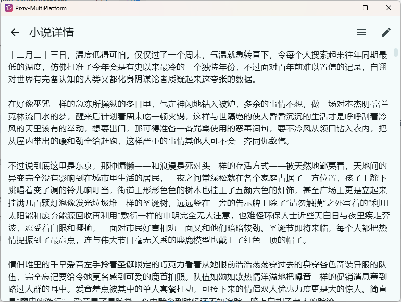
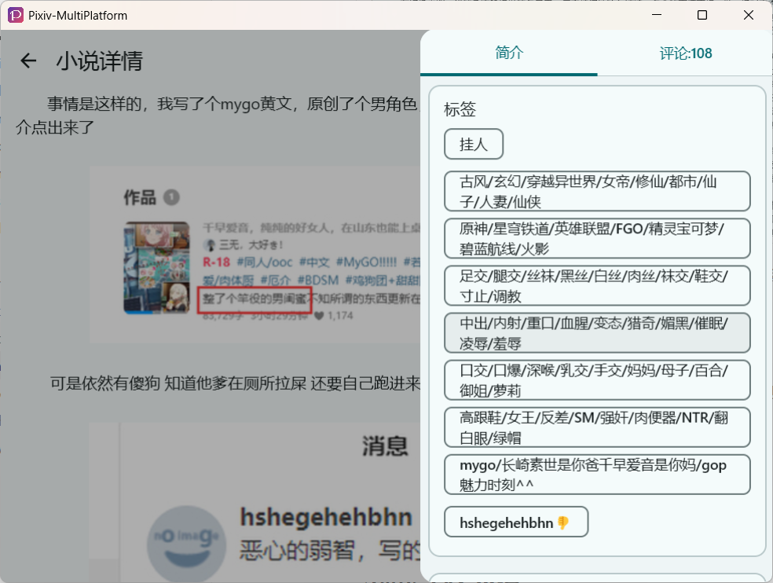
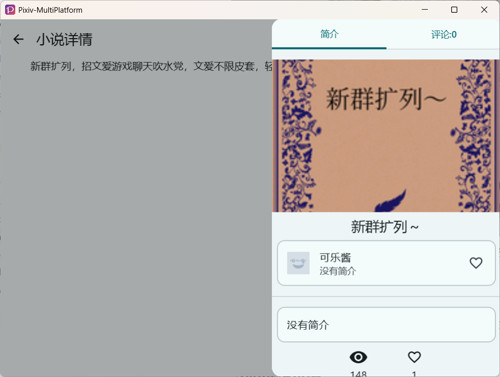

# ノベル

## 1. ブラウジング

ノベルブラウジングページはこのようになります：

| PC                                                           | Android                                                      |
| ------------------------------------------------------------ | ------------------------------------------------------------ |
|  |  |

- 右上のペンアイコンをクリックしてノベル詳細サイドバーを表示します。カバー画像、著者情報、タイトルなどの情報が含まれます
- ハートをクリックするとブックマークします、タグコンテンツをクリックするとタグで検索します
- コメントをクリックしてコメントセクションを表示します

## 2. ノベルプレビュー設定

### 自動フォーマット (デフォルトで有効)

自動フォーマットは、ノベルの文字的な違いを除外し、より快適な読書体験を提供できます。

比較は以下の通りです：

| 自動フォーマット有効                                      | 自動フォーマット無効                                     |
| ------------------------------------------------------------ | ------------------------------------------------------------ |
|  |  |

> `本体サイズ` 設定でノベルのフォントサイズを調整できます。 これにより、行の高さも相応に調整されます。

:::details 自動フォーマットは何をするのですか?

1. 最初の行を 2 文字幅でインデント

   > Compose のバグにより、これは間隔を追加することでしかるのは実装できません。

2. 正規表現を使用して余分な空白行を削除

3. 各段落の前後の間隔を完全に削除

自動フォーマットの具体的なコード実装を知りたい場合は、[rich-text.kt](https://github.com/magic-cucumber/Pixiv-MultiPlatform/blob/483bf913a2cb98a3df0056468e0f77a12d5b58fa/composeApp/src/commonMain/kotlin/top/magic-cucumber/pmf/ui/util/rich-text.kt#L234) を参照してください

:::

### 長い TAG ノベルをフィルタリング

おそらく、検索結果で過剰なタグを持つこのタイプのコンテンツを見たことがあるでしょう：

この機能は TAG の長さをチェックすることでそのような記事をおよそブロックできます。

:::warning

プレビュータイプの記事もこのトラフィック用に非常に長い TAG を使用する傾向があります。

この機能があなたのユーザー体験に影響する場合は、オフにしてください (デフォルトではオフです)。

:::

### 超短編ノベルをフィルタリング

検索結果で空白を占めているこれらの種類の ~~記事~~ を持たない実質的なコンテンツを見たことがあるでしょう：

この機能は、この記事の総単語数をチェックすることでそのようなコンテンツをブロックし、検索結果に必要なコンテンツを表示し、これらの連絡交換やロールプレイメッセージを表示できます。

> もちろん、この機能を使用して、指定された単語数を超える記事のみを表示することもできます。

### ノベルをフェッチするときシリーズをフェッチ

有効にした場合、ノベルがシリーズに属している場合、ナビゲーションバーがノベルの下部に表示され、前のチャプター/次のチャプターにすばやくアクセスできます。

この機能を無効にすると、シリーズに属するノベルでも、ナビゲーションバーは表示されません。

:::tip

この機能は、複数章のノベルやシリーズを読むのに特に役立ちます。ノベル詳細ページ→ノベルシリーズページに移動して 1 つずつ選択する必要なく、チャプター間のシームレスなナビゲーションを提供します。

:::