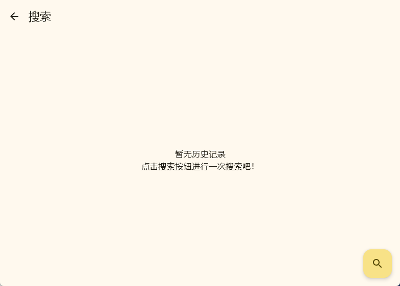
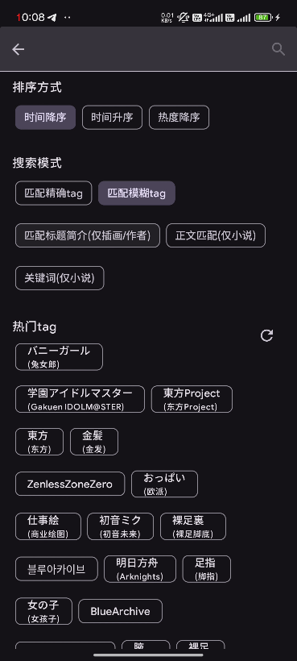
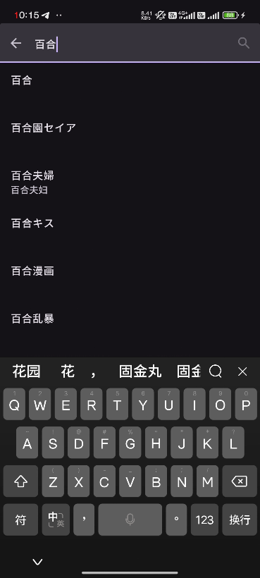
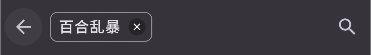
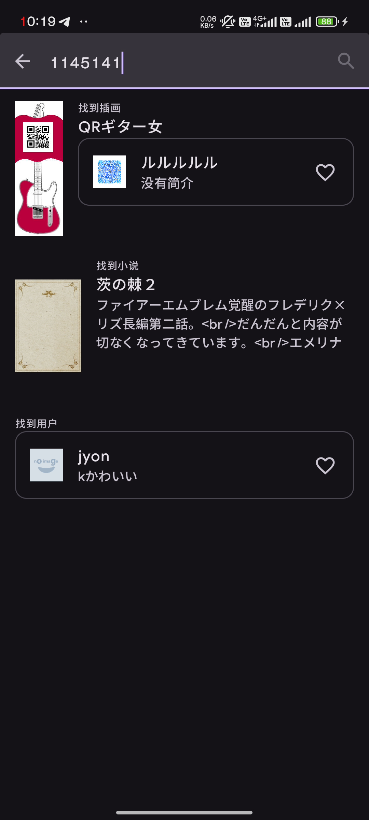

# 検索

## 検索を開始する方法

ホームページの左上 (Android **右上**) の虫眼鏡アイコンをクリックして検索ページを入力します。

| デスクトップ                                                                                            | 携帯                                                                                              |
| -------------------------------------------------------------------------------------------------- | -------------------------------------------------------------------------------------------------- |
|  |  |

> 左はアクセス履歴レコードのないページを示し、右はアクセス履歴レコードのあるページを示しています。
> 
> ゴミ箱アイコンをクリックして削除します。 エントリをクリックして TAG 選択ページに移動します。

右下の虫眼鏡をクリックしてこれまでの検索を開始します。

## 検索ページ

### ソート方法

3 つの方法を使用して検索できます：時系列で降順、時系列で昇順、人気度で降順。

::: tip

Pixiv Premium メンバーでない場合、人気度で降順を検索すると、部分的な結果のみが返されます。

検索これらの方法をサポートしない場合があります。 設定しても効果がありません。

:::

### 検索モード

全 5 つの検索モードがあります。

最初の 2 つの検索モードは **TAG で検索する必要があります**。

後の 3 つの検索モードは TAG 選択ページをポップアップしません。

括弧内のオプションは、検索モードが括弧内に指定されたオプションのみを検索することを示します。 たとえば：

`キーワード` 検索モードはノベルのみをサポートします。

### 人気タグ

ページに入ると、人気のあるタグがロードされます。 これらのタグをクリックすると、上記の選択ボックスにタグが直接入力されます。

::: warning

タグをクリックすると、検索モードが自動的に次のように変更されます：**完全なタグに一致**

:::

## TAG のキーワード検索

入力ボックスにキーワードを入力して検索します。 たとえば：

::: tip

いくつかの TAG には対応する日本語の名前があります。 これらのタグをクリックしても、英語のキーワードが入力されます。

:::

タグをクリックすると、タグが上記の入力ボックスに入力されます。 タグの右側の x をクリックして削除します。

## 特別な検索

`イラスト/ノベル (シリーズ)/著者` リンク用の純粋な数値検索をサポートしています。 対応する ID を入力ボックスに貼り付けるだけです。

検索結果から好きなものを見つけてクリックしてください!

