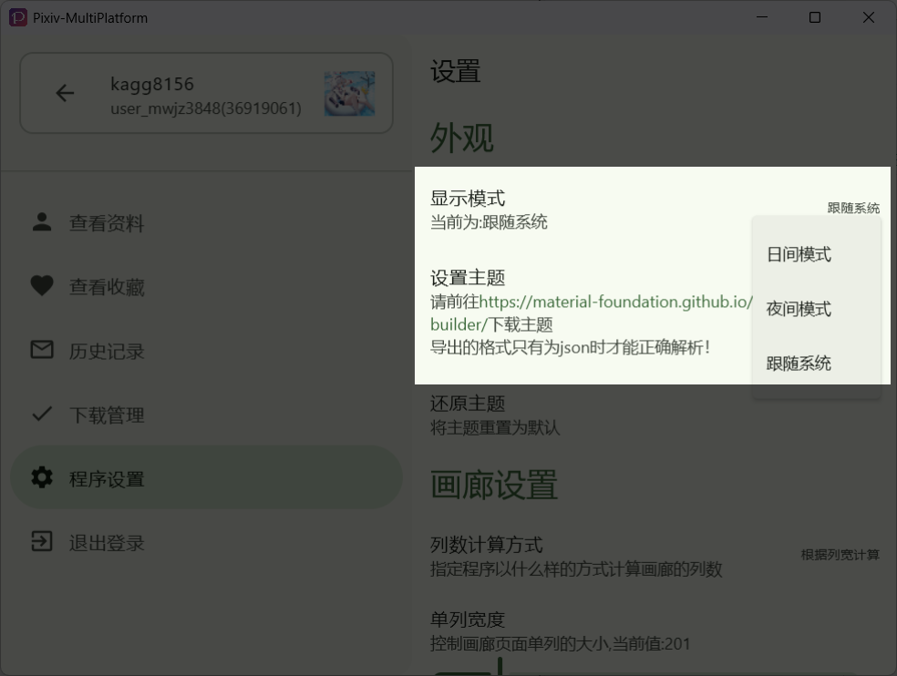
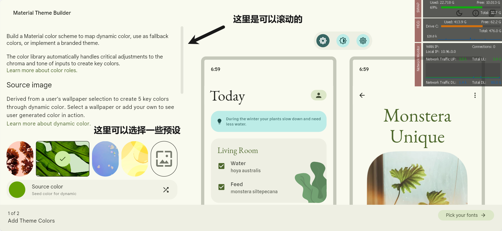
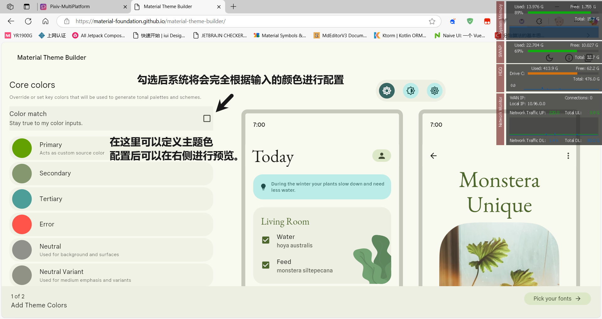
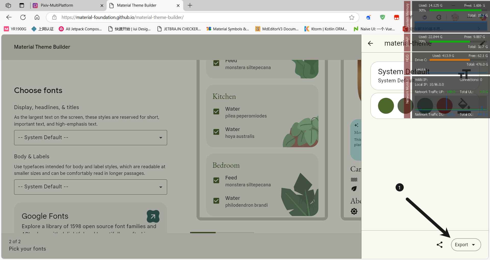
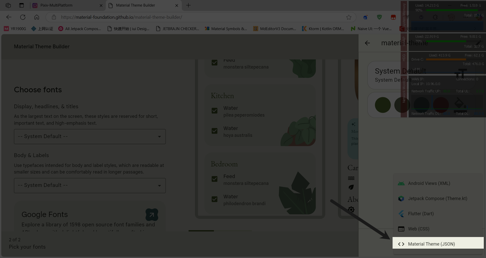
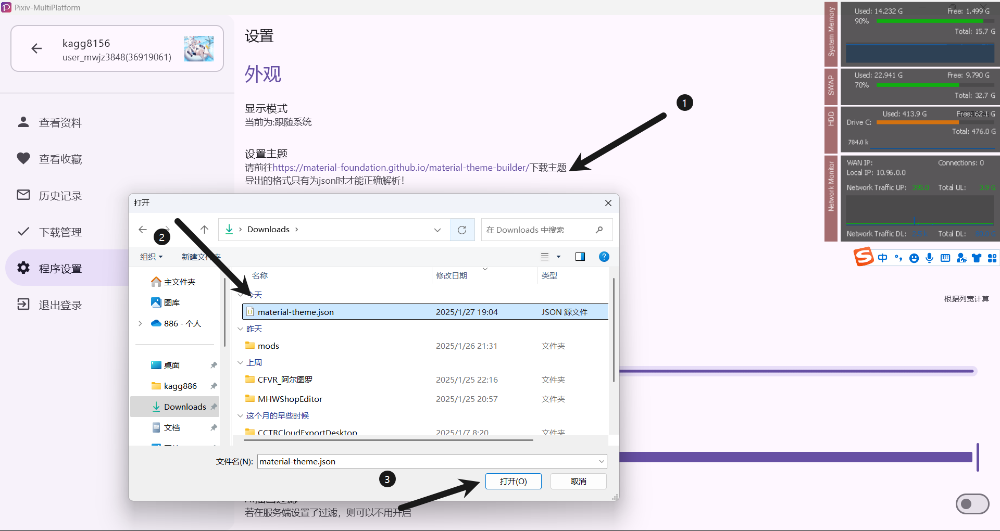
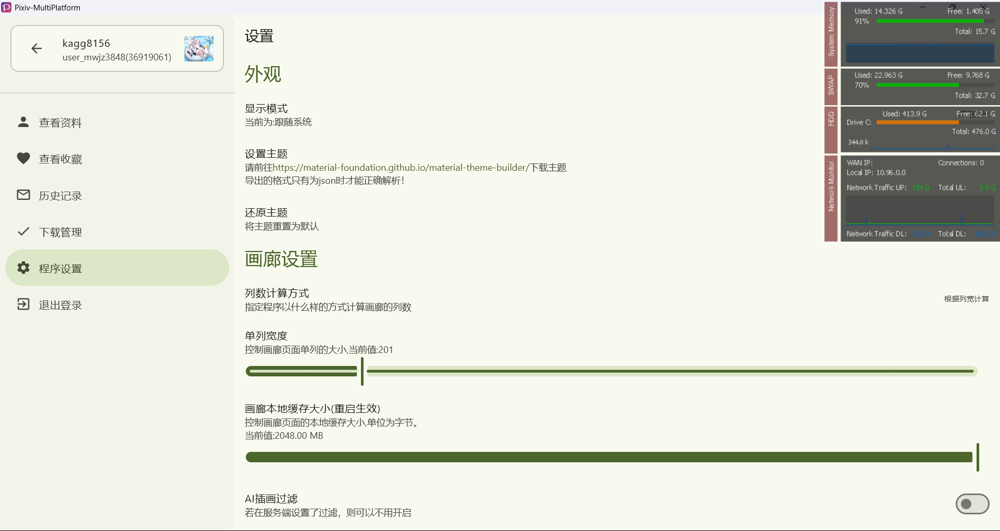

# テーマ

## 昼夜テーマモード切り替え

Pixiv-MultiPlatform はシステム設定に従ってナイトモードを表示することができます。

## カスタムテーマ

1. [Material Theme Builder](https://material-foundation.github.io/material-theme-builder/) を開く

   

2. 好きな色を設定してください
   

3. 右下の `フォントを選択` をクリックしてから、`テーマをエクスポート` をクリックしてください

   

4. エクスポートタイプについては、`Material Theme(JSON)` を選択してください

   

5. エクスポート後、ソフトウェア設定を開き、テーマインポートをクリックしてください。

   

6. その後、テーマは成功しました! 