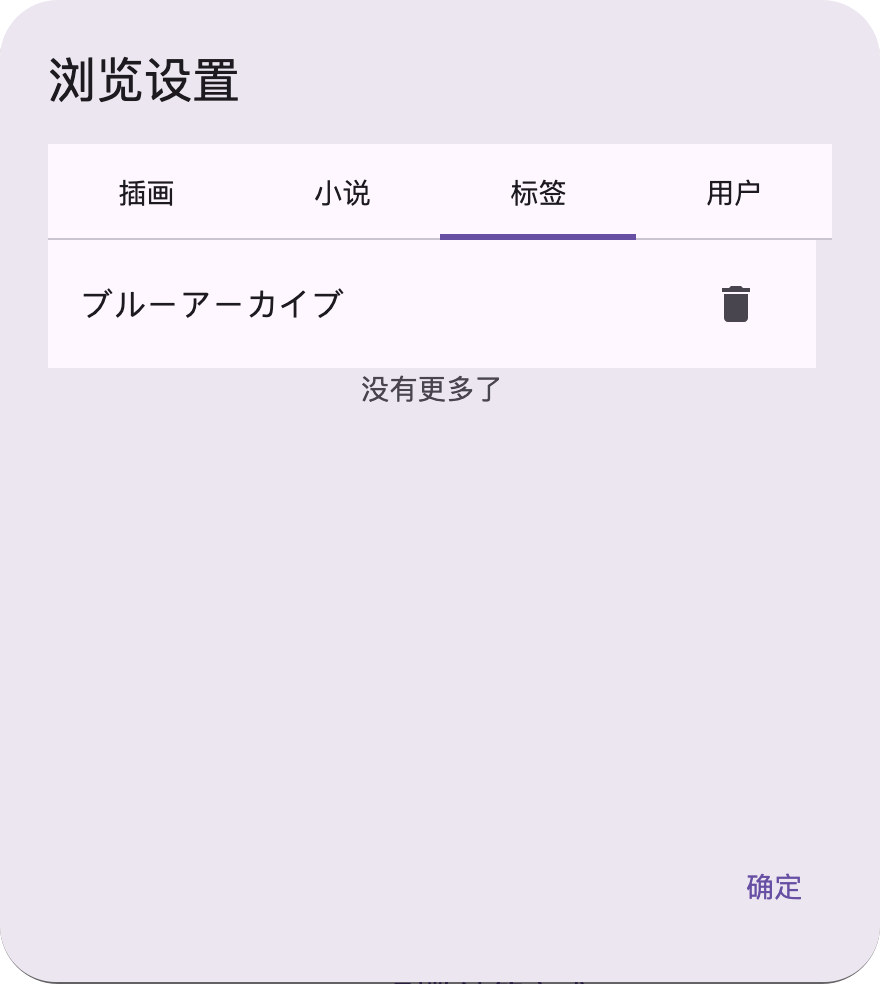

# 黑名单系统

:::warning
**仅适用于 PMF v1.8.3 以上版本。**
:::

### 简介

PMF 软件为您提供了一套强大的内容过滤功能，可以帮助您屏蔽掉不希望看到的内容，主要包括**标签过滤**和**用户过滤**两种方式。

* **标签过滤：** 专门用于在插画和小说搜索页面中，自动隐藏或过滤掉含有特定标签的作品数据。
* **用户过滤：** 会完全屏蔽指定用户发布的所有插画和小说作品，让它们不再出现在您的视野中。

---

### 如何进行过滤？

您可以通过以下两种简单的方式将不希望看到的内容添加到黑名单中：

#### 2.1 过滤用户

如果您决定屏蔽某个用户的所有作品，可以在任意一个展示该用户信息的页面（例如：插画详情页、小说详情页或用户个人主页）的上方区域，找到并点击一个名为：

> **添加此用户到屏蔽列表**

的按钮或链接。点击后，系统会提示您确认是否将该用户加入黑名单。

#### 2.2 过滤标签

当您想屏蔽某个特定的标签时，可以在以下任一页面进行操作：插画详情页、小说详情页，或标签搜索结果页。

您需要在作品的 **TAG 条目**（即标签本身）上进行操作：

* **电脑端：** 使用鼠标**右键**点击该标签。
* **手机端：** 对该标签进行**长按**操作。

执行上述动作后，屏幕上会弹出一个**屏蔽确认对话框**，让您确认是否将该标签添加到过滤列表中。

### 过滤后的影响

设置了黑名单过滤后，您在使用 PMF 软件浏览内容时会产生以下变化：

#### 3.1 过滤用户后的影响

一旦您将某个用户加入黑名单，当您尝试点击进入这位用户的**简介页面**（即个人主页）时，软件会**拒绝加载**该页面，您将无法查看此用户的任何信息或作品列表。

#### 3.2 过滤标签后的影响

如果您过滤了特定的标签，这些标签将不再显示在：

* **热门标签列表**中。
* 当您在搜索框中输入内容进行**搜索时**，如果您的搜索内容**携带了被屏蔽的标签**，软件将**拒绝执行**此次搜索。

:::tip 为什么要这么做？

这是出于对服务器资源和访问安全性的考虑。

允许用户随意查看带有大量被屏蔽内容的页面（比如某个带有被屏蔽标签的大型搜索结果页），势必会造成 PMF 软件对服务器发送大量的过滤和请求。

这种短时间内的大量请求可能会触发 pixiv 官方服务器的风险控制机制，从而可能导致您的访问被限制。

因此，屏蔽这些可能造成大量请求的页面是一种保护措施.
:::

### 如何解除屏蔽？

如果您希望移除之前添加的黑名单规则，让被屏蔽的内容重新显示，可以通过以下步骤进行管理：

1.  **打开 PMF 软件的设置页面**
2.  进入名为**“浏览设置”**的选项卡
3.  在浏览设置中，寻找并点击打开**“黑名单管理”**对话框（或按钮）
4.  在弹出的管理对话框中，您可以看到已设置的黑名单规则被清晰地分为对应的两个主要分类：**标签黑名单**和**用户黑名单**。
5.  **进行管理与删除：** 在相应的分类列表中，找到您希望解除屏蔽的标签或用户名称，并执行**删除**操作即可。一旦规则被移除，对应的内容将重新出现在您的浏览结果中。

